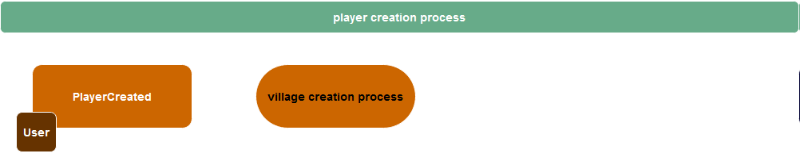
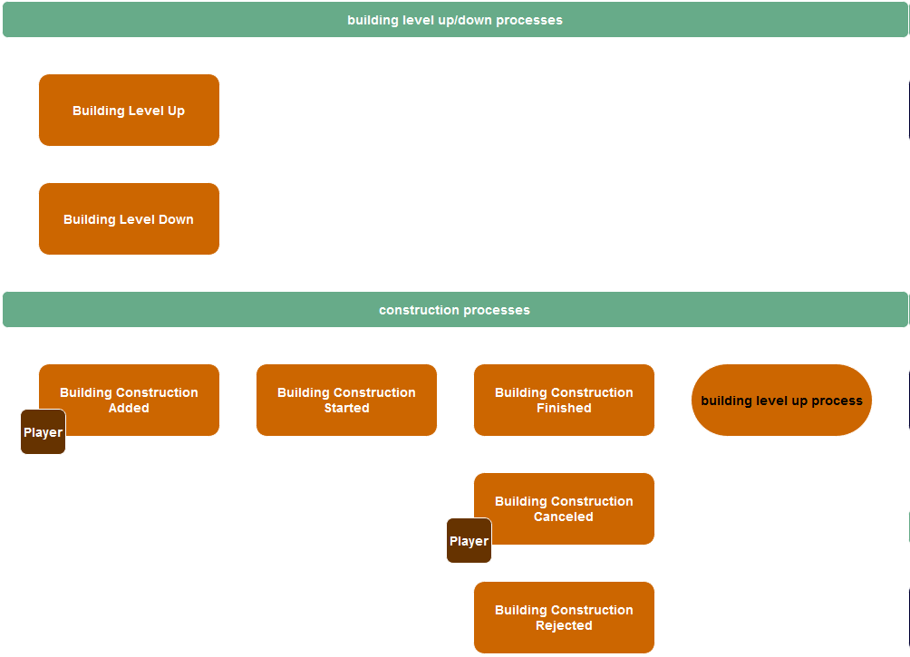
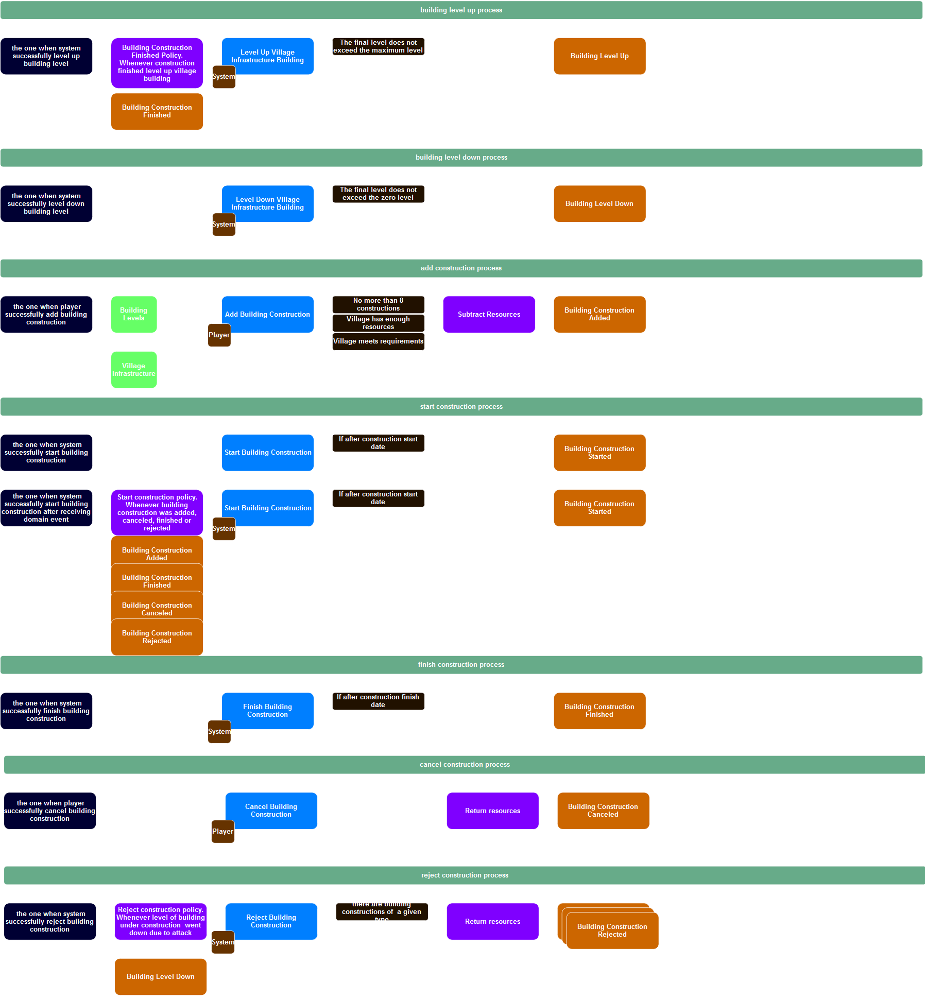
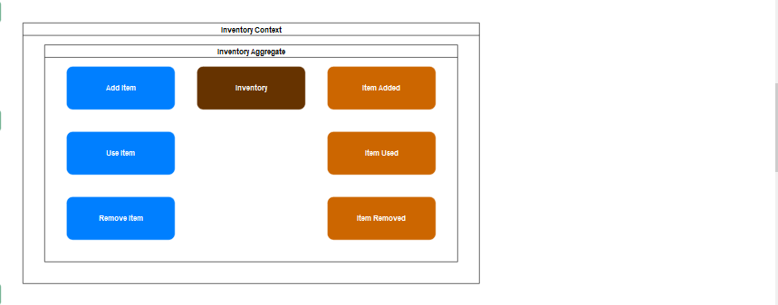
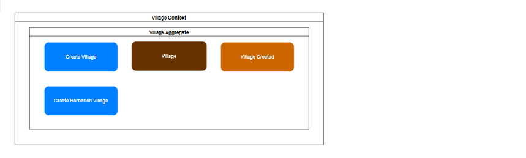
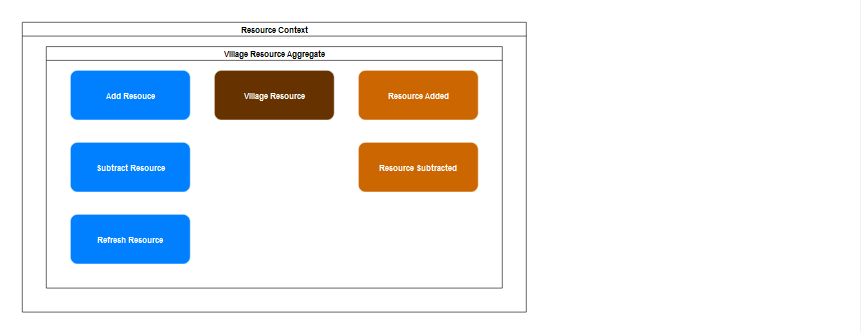
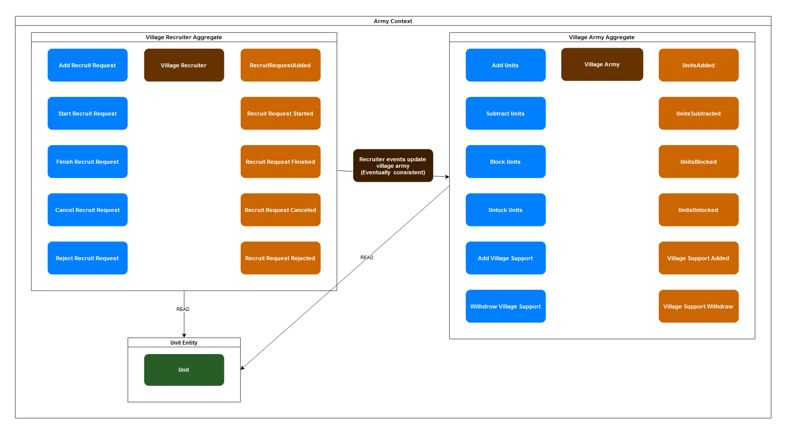
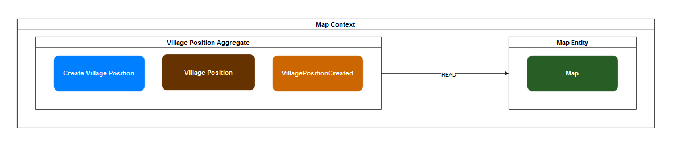
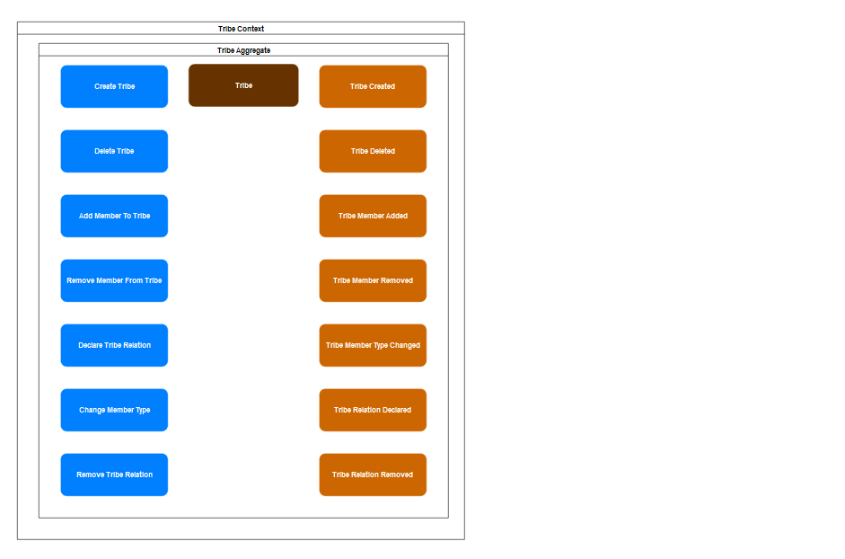

# 

## Introduction and Goals
The game is a multiplayer online strategy game inspired by Tribal Wars, where players build villages, train armies, and compete for dominance in world. The system must support thousands of concurrent players, offer real-time interactions, and be scalable for future expansions.

### Requirements Overview
Features:
- Core Gameplay: Village building, resource management, army training, and strategic battles.
- Player Interaction: Alliance formation, diplomacy, and trading between players.
- Scalability: Handle up to 1000 concurrent users on a single server.
- Accessibility: Playable on desktop (browser-based).
- Fairness and Security: Ensure balanced gameplay with anti-cheating mechanisms.

### Quality Goals

| Goal        | Motivation/description                                            | 
|-------------|-------------------------------------------------------------------|
| Security    | Protect against cheating, unauthorized access, and data breaches. |
| Reliability | System ensuring minimal downtime during server maintenance.       |

### Stakeholders

| Role/Name           | Expectations                                                             |
|---------------------|--------------------------------------------------------------------------|
| Players             | Expect engaging gameplay and fair rules.                                 |
| Developers          | Need a maintainable and extensible codebase for future updates.          |
| Game Administrators | Tools to manage game worlds, monitor player activity, and enforce rules. |

## Architecture Constraints
### Technical Constraints

| Constraint          | Description                                                                                                |
|---------------------|------------------------------------------------------------------------------------------------------------|
| Database Technology | Integration with NoSQL solutions (e.g., MongoDB) for high-performance tasks like caching and leaderboards. |
| Observability       | System  must send metrics for further analysis                                                             |

### Organizational Constraints

| Constraint          | Description                                                                                                |
|---------------------|------------------------------------------------------------------------------------------------------------|

### Conventions

| Constraint                 | Description                                                          |
|----------------------------|----------------------------------------------------------------------|
| Architecture documentation | Terminology and structure according to the arc42 template.           | 
| Java applications          | Application written in Ports & Adapters (aka Hexagonal) architecture |

## Context and Scope

## Solution Strategy

| Goal                 | Description                                                             |
|----------------------|-------------------------------------------------------------------------|
| Security             | Implement OAuth2 for secure player authentication                       |
| Development Strategy | Use GitHub Actions to automate testing, build and deployment pipelines. |
| Deployment Strategy  | Staging Environment or testing before pushing to production.            |

## Building Block View
Diagram from 3.1. section displaying all systems:

| System                                      | Description                                                                    |
|---------------------------------------------|--------------------------------------------------------------------------------|
| Game system                                 | Main system responsible for gameplay.                                          |
| Identity and Access Management (IAM) system | System responsible for authentication and user management.                     |
| Observability System                        | System responsible for collecting telemetry signals: traces, metrics and logs. |

### Level 1 - Game system
The system architecture consists of three main components: the frontend, backend, and supporting infrastructure.

| System or components      | Description                                                                                                  |
|---------------------------|--------------------------------------------------------------------------------------------------------------|
| Frontend                  | Developed using Angular, providing a dynamic and responsive user interface for web-based access to the game. |
| Backend                   | The backend is implemented in Spring Framework                                                               |
| supporting infrastructure | The system uses MongoDB as the primary database. Additionally Apache Kafka is utilized as a messaging system |

#### modeling
##### **introduction**
To model the domain, the DDD (Domain-Driven Design) approach was applied, complemented by Event Storming. Event Storming is an excellent tool for supporting DDD processes, particularly during the exploratory and design phases. It facilitates the identification of domain events, the modeling of business processes, and the development of a shared language among all stakeholders.

Event Storming is created using draw.io, and the corresponding file is located in the designated folder(`./f17.drawio`).
Below, an exported image of the documentation is provided for reference:

##### **Domain Description**
Game is an online strategy game where players build and manage their villages while competing for dominance with other tribes. Each tribe can consist of multiple players, with one designated as the tribe leader. Players develop their villages by gathering resources, constructing buildings, and training armies.

Resources include wood, stone, and iron, and are gathered through resource buildings. Resources are also acquired by raiding other villages or through trade. A village can store only a limited amount of resources, based on its storage capacity.

Ranking system, where individual players and tribes are ranked by their accumulated battle points. Battle points are earned by winning battles against other players. Battles can either be offensive (initiated by a player) or defensive (when the player is attacked by another player).

Each player has a home village. Villages can be expanded by constructing new buildings or upgrading existing ones, which requires resources and time.

Tribes can form alliances with other tribes, creating larger coalitions. Wars are declared officially within the game, and all battles between warring tribes during the war period contribute to the war score.

Players can train different types of units and use them to attack.

Victory can be achieved by becoming the top-ranked tribe by battle points when the game world ends.

##### **Strategic Design (ES: Pig Picture & Process Modeling)**
During modeling, the following **definitions** were established as universal concepts, applicable across all bounded contexts within the domain:
- player - represent user in game;
- money - premium currency;
- gold coins - player can mind them in Academy, required to conquer villages;
- inventory - player container for items;
- village resources - resources in village;
- refresh resources - adds resources to village depending on the level of resource buildings;
- village builder - management of building constructions in village;
- village infrastructure - building in village;
- village army - village units
- village recruiter - management of recruit units in village;
- available unit - unit that belongs to the village and can be sent out
- blocked unit - unit that belongs to the village, but is unavailable, e.g., because of an expedition
- village loyalty - if loyalty falls below 0 village will be conquered;
- effects - active effects in village, effects can, for example, raise productions;
- village position - village position on map;
- tribe - group of players;

##### **Legend**:

##### **ES. Pig Picture, examples:**
- at first player related processes:
  
- resource related processes:
  
- building related processes:
  

##### **ES. Process Modeling, examples:**
- player related processes:
  
- resource related processes:
  
- building related processes:
  

##### **Tactical Design (ES: Pig Picture & Design Modeling)**
After documenting and describing the processes, the following **bounded contexts** were identified:

##### 1. player context
Implemented in Layered architectural patter as Active Record.

Objects:
- Player Entity

##### 2. player money context
Implemented in Port & Adapters architectural patter as Domain Model.

Aggregates:
- Player Money

##### 3. player gold coin  context
Implemented in Port & Adapters architectural patter as Domain Model.

Aggregates:
- Player Gold Coin

##### 4. inventory context
Implemented in Port & Adapters architectural patter as Domain Model.

Aggregates:
- Inventory

##### 5. village context
Implemented in Port & Adapters architectural patter as Domain Model.

Aggregates:
- Village

##### 6. village resource context
Implemented in Port & Adapters architectural patter as Domain Model.

Aggregates:
- Village Resource

##### 7. village builder context
Implemented in Port & Adapters architectural patter as Domain Model.

Objects:
- Village Builder Aggregate
- Village Infrastructure Aggregate
- Building Entity

##### 8. village army context
Implemented in Port & Adapters architectural patter as Domain Model.

Objects:
- Village Recruiter Aggregate
- Village Army Aggregate
- Unit Entity

##### 9. village loyalty context
Implemented in Port & Adapters architectural patter as Domain Model.

Aggregates:
- Village Loyalty

##### 10. village effects context
Implemented in Port & Adapters architectural patter as Domain Model.

Aggregates:
- Village effects

##### 11. map context
Implemented in Port & Adapters architectural patter as Domain Model.

Objects:
- Village Position Aggregate
- Map Entity

##### 12. army walk context
Implemented in Port & Adapters architectural patter as Domain Model.

Aggregates:
- Army Walk

##### 13. tribe context
Implemented in Port & Adapters architectural patter as Domain Model.

Aggregates:
- Tribe

#### Level 2 - Backend
// TODO
#### Level 2 - Frontend
// :)

### Level 1 - Identity and Access Management (IAM) system
The system integrates Keycloak as the Identity and Access Management (IAM) solution, eliminating the need to develop custom authentication and authorization mechanisms.
This choice reduces development effort, enhances security, and ensures compliance with modern authentication standards like OAuth2 and OpenID Connect.

### Level 1 - Observability System
The observability system is designed to provide comprehensive monitoring and troubleshooting capabilities by collecting, processing, and visualizing telemetry data. The core of the system leverages the OpenTelemetry (OTel) Collector to gather signals from various components of the application, including metrics, traces, and logs.
All observability data is integrated into Grafana, providing a unified dashboard for:
- Real-time metrics visualization (Prometheus).
- Viewing and analyzing distributed traces (Tempo).
- Querying and correlating logs (Loki).

## Runtime View
// TODO
## Deployment View
Deployment diagram - dev:

## Cross-cutting Concepts

### Clean Architecture
Architecture is described in book: *Get Your Hands Dirty on Clean Architecture, by Tom Hombergs*.

## Architecture Decisions
[Link](/workspace/decisions)

## Quality Requirements

## Risks and Technical Debts

## Glossary

| Term        | Definition                |
|-------------|---------------------------|
| Tribal Wars | InnoGames game from 2003. |
